# NGO Donation Management Portal — DevOps Project Context

> **For the report writer.** This file is the source of truth for the final
> report, presentation and viva notes. Everything below was built and verified
> during the project; the logs in `docs/evidence/` are real command output.
> Do not invent results, build numbers or metrics. If something is not here or
> in the evidence files, say it was not done or ask the student. Items marked
> **[screenshot]** are things the student must capture from their own screen
> (Jenkins UI, browser), because they cannot be produced from the repository.

---

## 1. Project at a glance

**Application.** A donation management portal for an NGO ("MICF NGO").
- **Donors** (no login) browse active campaigns, donate, and download a PDF
  donation certificate that can be verified by ID.
- **Admins** manage campaigns and verify or reject donations.
- **Volunteers** view campaigns, donations and a dashboard.
- Auth is JWT-based; passwords are stored as bcrypt hashes.

**DevOps goal.** Demonstrate a full pipeline:
Git feature branches + PRs → Jenkins CI → Selenium quality gate → Tomcat/Nginx
deployment → Docker image build/registry/container deployment → Ansible
provisioning of a clean server with health checks, idempotency and rollback.

**Student / author:** Aryan Kulkarni (GitHub `AryanKulkarni11042005`), BE DevOps
mini project.

## 2. Repositories and branching

| Repo | Contents |
|---|---|
| `NGO-Donation-Management-AryanKulkarni-23102B0072` (this repo) | `frontend/` (React), `selenium-tests/` (Java/Maven), `nginx/`, `ansible/`, `Jenkinsfile`, `docker-compose.yml`, `docs/` |
| `ngo-donation-portal-springboot` | Spring Boot backend (`store.war`) and its `Dockerfile`. The Jenkins pipeline clones its `main` branch into `backend-springboot/` on every run |

**Branching model.** Every feature/phase is a `feature/*` branch merged by Pull
Request into the integration branch `new-branch` (`main` is the GitHub default).
PRs #2–#21 cover:
- **App features:** scaffold, auth, campaigns, donation flow, public login link,
  dashboard, certificate, UI polish.
- **DevOps phases:** `feature/jenkins-tomcat-pipeline` (#11, #13–#16),
  `feature/selenium-test` (#17, #18), `feature/docker-ansible-cd` (#19),
  `feature/jenkins-docker-cd` (#20, #21), and `feature/ansible-provisioning`
  (this phase).

**History note.** The backend started as Node/Express + TypeScript inside this
repo. It was replaced by the Spring Boot backend (separate repo), and the
unused Node `backend/` folder was deleted in PR #19. The database schema
originally written for it is kept as `ansible/roles/postgres/files/schema.sql`
(the Spring entities map onto the same tables).

## 3. Technology stack (versions as installed)

| Layer | Technology |
|---|---|
| Frontend | React 18, TypeScript 5, Vite 5, Tailwind CSS 3, react-router 6, axios (`baseURL` `/store`) |
| Backend | Spring Boot 4.1.0 (WAR, context path `/store`), Spring Security + JWT, Hibernate 7.4, Lombok; compiled for Java 17 |
| Database | PostgreSQL. Local dev: EDB install on port 5433. Compose: `postgres:16-alpine`. Ansible node: Ubuntu PostgreSQL 16.15 |
| App server | Apache Tomcat 11.0.24 (local Homebrew and Ansible node); `tomcat:10.1-jdk17-temurin` in the Docker image |
| Web server / proxy | Nginx 1.31.3 (Homebrew), `nginx:1.27-alpine` (frontend image), nginx 1.24 (Ubuntu node) |
| CI/CD | Jenkins LTS 2.568.1 (Homebrew service, `localhost:8080`); Jenkins tools `node-lts` (NodeJS plugin) and `maven` |
| Testing | JUnit 5 + Mockito unit tests in the backend (38 tests); Selenium 4.27 + JUnit 5.11.4 E2E suite (10 tests, headless Chrome) |
| Containers | Docker Desktop 29.6.1 (arm64), Docker Compose, local registry `registry:2` |
| Config management | Ansible 14.4 (ansible-core 2.21.4), collections `community.postgresql` 4.2.0, `ansible.posix` |
| Host | macOS on Apple Silicon (arm64); everything runs on one machine |

## 4. Architecture

### 4.1 Delivery pipeline (Jenkinsfile, job `ngo-donation-portal-pipeline`)

```mermaid
flowchart LR
  A[git push / PR merge] --> B[Checkout<br/>this repo + springboot repo]
  B --> C[Compile<br/>npm ci, mvn compile]
  C --> D[Test<br/>38 JUnit tests]
  D --> E[Package<br/>vite build + store.war]
  E --> F[Deploy WAR to Tomcat<br/>+ frontend to Nginx]
  F --> G[Verify<br/>/store/health]
  G --> H{Selenium E2E<br/>10 tests}
  H -- fail --> X[Pipeline FAILS<br/>no image, no deploy]
  H -- pass --> I[Build Docker Image<br/>tag = BUILD_NUMBER]
  I --> J[Push to registry<br/>localhost:5050]
  J --> K[Deploy Container<br/>ngo-backend-cd :8093]
  K --> L[Verify Container]
  L --> M[Provision Node<br/>Ansible: release build-N]
  M --> N[healthcheck.yml]
```



The `post` block always publishes JUnit reports
(`**/target/surefire-reports/*.xml`, backend unit tests + Selenium) and
archives `store.war` with fingerprinting.

### 4.2 Runtime environments and ports (all on the one Mac)

| Environment | Component | Address |
|---|---|---|
| CI | Jenkins | `localhost:8080` |
| Bare-metal "staging" (Task 2 target, used by Selenium) | Homebrew nginx → frontend + proxy `/store/` | `localhost:8081` |
|  | Homebrew Tomcat 11 serving `store.war` | `localhost:8082/store` |
|  | PostgreSQL (EDB) | `localhost:5433` |
| Docker CD (Task 5) | Local registry | `localhost:5050` (5000 is taken by macOS AirPlay Receiver) |
|  | Container `ngo-backend-cd` from `localhost:5050/ngo-backend:<build>` | `localhost:8093/store` (uses host DB via `host.docker.internal:5433`) |
| Docker Compose stack (Task 4) | frontend (nginx) / backend (Tomcat) / `postgres:16-alpine` | `localhost:8091` / internal 8080 / `localhost:5434` |
| Ansible lab node `ngo-node-1` (Tasks 6–7) | SSH / HTTP (nginx → Tomcat → PostgreSQL inside the node) | `localhost:2222` / `localhost:8095` |

### 4.3 Request path (same shape in every environment)

Browser → **nginx** serves the React build; `location /store/` →
`proxy_pass` → **Tomcat** (`/store` context = Spring Boot WAR) → JDBC →
**PostgreSQL**. Public endpoints include `GET /store/health`,
`GET /store/campaigns`, `POST /store/donations`, `GET /store/certificates/**`,
`POST /store/auth/login`. Staff endpoints need a JWT (`/donations`,
`/dashboard`, campaign writes).

---

## 5. Task-by-task record

### Task 1 — Jenkins installation and CI job

- **Install.** Jenkins LTS via Homebrew, run as a background service on
  `localhost:8080`. Plugins: suggested set + NodeJS + Git/GitHub + Pipeline.
- **Tool.** Manage Jenkins → Tools → NodeJS installation named `node-lts`
  (auto-install from nodejs.org, NodeJS 26.6.0). A `maven` tool was added
  later for the pipeline.
- **Freestyle job `ngo-donation-management`.**
  - SCM: Git, this repo, branch `*/new-branch`.
  - Triggers: **Poll SCM `H/5 * * * *`** + **GitHub hook trigger for GITScm
    polling**.
  - Build environment: "Provide Node & npm bin/ folder to PATH" = `node-lts`.
  - Build step "Execute shell": `cd backend && npm ci && npm run build`, then
    the same in `frontend` (the npm equivalent of a Maven/Gradle build; the
    project is JavaScript/TypeScript, not Java, at this stage).
  - Post-build: **Archive the artifacts** `backend/dist/**, frontend/dist/**`.
- **Issues hit.**
  1. Build #1 `FATAL: No installation null found` — the NodeJS installation
     wasn't selected in the job's Build Environment.
  2. "`backend/dist/**` doesn't match anything" — the pattern is checked
     against the Jenkins workspace (`~/.jenkins/workspace/<job>`), not the
     developer's project folder, and no build had succeeded there yet.
- **Result.** Build #3 (2026-08-05) SUCCESS, artefacts archived. Build #1 was
  started by an SCM change (polling): trigger evidence.
- **Now.** The Node `backend/` folder no longer exists (removed in PR #19), so
  this historical job's `cd backend` step would fail if re-run. It is kept as
  Task 1 evidence. To revive it, change the shell step to frontend-only and
  archive `frontend/dist/**`.
- **[screenshot]** Job config (SCM, triggers, build env, shell step, archive),
  build #3 console, build artefacts list.

### Task 2 — Pipeline as code and server deployment

- `Jenkinsfile` (declarative) read by Pipeline job
  `ngo-donation-portal-pipeline` via "Pipeline script from SCM".
- **Stages:** Checkout (this repo + `git` the Spring Boot repo into
  `backend-springboot/`) → Compile → Test → Package WAR → **Deploy WAR to
  Tomcat** → Verify.
- **Deploy stage.**
  - Copies `frontend/dist` to `/opt/homebrew/var/www/ngo-frontend` and
    `nginx/nginx.conf` into Homebrew nginx.
  - Runs `nginx -t` *before* restarting (a bad config fails the build instead
    of taking the site down), then restarts nginx.
  - Removes the old exploded `store/` dir plus `store.war` (otherwise Tomcat
    can keep serving old classes) and copies the new WAR.
  - Writes `DB_PASSWORD` and `JWT_SECRET` from Jenkins credentials (`db-password`,
    `jwt-secret`) into Tomcat's `setenv.sh` (umask 077, chmod 700), then
    restarts Tomcat.
- **Verify** polls `http://localhost:8082/store/health` (12 × 5 s) instead of
  sleeping for a fixed time.
- **Parameters.**
  - `ENVIRONMENT` (choice `staging`/`production`) is printed in the deploy and
    success messages. It labels the run but does not switch targets (see
    Limitations).
  - `PROVISION_NODE` (boolean, added in the final phase) changes behaviour:
    it turns the Ansible stage on or off.
- Absolute paths (`/opt/homebrew/bin/brew`, `.../nginx`) are needed because
  Jenkins runs with `PATH=/usr/bin:/bin:/usr/sbin:/sbin`.
- **Deployed URL:** `http://localhost:8081` (frontend) /
  `http://localhost:8082/store/health`.
- **[screenshot]** Stage view of a green run, Build with Parameters page,
  the site in a browser.

### Task 3 — Continuous testing (Selenium quality gate)

- **Suite** `selenium-tests/` (Maven, JUnit 5, Selenium 4.27, headless Chrome
  via `--headless=new`; base URL `-Dbase.url=http://localhost:8081`). One
  browser per test class (`BaseE2ETest`).
  - `LoginTest` (5): staff login link opens login; form has email + password;
    empty submit shows validation without calling the backend; wrong
    credentials are rejected ("Invalid email or password" — proves the browser
    reached the backend); protected route redirects to login.
  - `PublicSiteTest` (5): landing page header shows "MICF"; campaigns from the
    backend render as cards; each card links to `/donate/<numeric id>`; cards
    show "₹… raised"; unknown routes redirect home.
- **Gate.** The Selenium stage runs before every Docker/Ansible stage. In
  declarative pipelines, a failed stage makes Jenkins skip all later stages
  ("Stage … skipped due to earlier failure(s)"), so failed tests stop
  deployment. Reports are published by `junit` in `post { always { … } }`.
- **Failed pipeline evidence (real defects).** See
  `docs/evidence/jenkins-failed-runs.md`, builds #17–#21. The gate caught an
  environment defect (stale container on port 8081 → 4 E2E errors) and a
  ChromeDriver/Chrome version mismatch. Both were fixed by commits `03157d2`
  and `d803d0c`, and the rerun (#21) passed 10/10.
- **Deliberately introduced defect.**
  - Commit `df3d55e` "[DELIBERATE DEFECT] Build donate links from the campaign
    title": `CampaignCard.tsx` uses `campaign.title` instead of `campaign.id`,
    so links point at `/donate/Clean Water Fund`. It compiles fine; only the E2E
    test `PublicSiteTest.campaignCardsLinkToDonatePage` (expects
    `/donate/\d+$`) catches it.
  - The fix commit and the failing/passing build numbers are recorded in
    section 8.
- **[screenshot]** Jenkins Test Result page (failed then passed), the stage
  view showing skipped Docker/Ansible stages on the failed run.

### Task 4 — Docker image and container lifecycle

- **Backend `Dockerfile`** (in the Spring Boot repo). Multi-stage:
  1. `maven:3.9-eclipse-temurin-17` runs `mvn dependency:go-offline` (cached
     layer), then `mvn package`.
  2. `tomcat:10.1-jdk17-temurin` removes the default ROOT app, copies
     `store.war`, `EXPOSE 8080`, `CMD catalina.sh run`.

  The final image carries no build tools.
- **Frontend `frontend/Dockerfile`.** Multi-stage `node:20-alpine` (`npm ci`,
  `vite build`) → `nginx:1.27-alpine` with `nginx/nginx.docker.conf`. That
  config proxies to the compose service name `backend-springboot:8080` instead
  of localhost. The build context is the repo root, hence the
  `COPY frontend/...` paths. `.dockerignore` excludes `node_modules`, `dist`,
  `target`, `.git`.
- **`docker-compose.yml`.**
  - `db` (`postgres:16-alpine`): schema mounted into
    `/docker-entrypoint-initdb.d`, healthcheck with `pg_isready`, port 5434.
  - `backend-springboot` (image `ngo-backend:latest`): `DB_URL` pointing at
    `db:5432`; waits for a healthy DB.
  - `frontend`: port 8091.
  - Secrets come from a git-ignored `.env`.
- **Backend config change for containers.** `spring.datasource.url` became
  `${DB_URL:jdbc:postgresql://localhost:5433/ngo-donation-portal}`. Inside a
  container, `localhost` is the container itself.
- **Lifecycle evidence:** `docs/evidence/docker-lifecycle.log` (2026-10-05).
  - Build and tag `ngo-backend:1.0.0` (832 MB, arm64) and `ngo-frontend:1.0.0`
    (76.3 MB).
  - Tag and push to `localhost:5050`.
  - `image inspect` and `history`.
  - `compose up`.
  - `docker run` with `-p 8096:8080`, then `ps`, `port`, `logs`, `inspect`,
    `stats` (≈355 MiB RAM).
  - `stop` (exit 143, health → HTTP 000), `start`, `restart` (healthy in ≈4 s
    each), `rm -f`.
  - The compose stack keeps serving `/store/campaigns` on 8091.
- **[screenshot]** `docker ps`, `docker images`, the app on
  `http://localhost:8091`.

### Task 5 — Jenkins → Docker continuous deployment

- **Stages after Selenium E2E** (only reached when all tests pass):
  1. **Build Docker Image:** `localhost:5050/ngo-backend:${BUILD_NUMBER}` and
     `:latest`.
  2. **Push to Registry:** pushes both tags.
  3. **Deploy Container:** `docker pull` the exact build tag, remove the old
     `ngo-backend-cd`, then `docker run -d -p 8093:8080` with `DB_URL`,
     `DB_PASSWORD` and `JWT_SECRET` from Jenkins credentials (masked as `****`
     in the log).
  4. **Verify Container:** polls `localhost:8093/store/health`.
- The Docker stages are wrapped in `withEnv(['PATH+DOCKER=/usr/local/bin'])`,
  because Docker's credential helper is invoked by bare name.
- **Registry choice:** a local `registry:2` on port 5050, chosen over Docker
  Hub to avoid account/token setup. Switching to Docker Hub means changing the
  image prefix and adding a `docker login` with a Jenkins credential.
- **Evidence:** build #21 SUCCESS (`docs/evidence/jenkins-failed-runs.md`,
  last section).
  - Image `localhost:5050/ngo-backend:21`, digest
    `sha256:6f92e6b6…4dace`.
  - Registry tags `["21","test-push","latest"]`.
  - `ngo-backend-cd` running `…:21`, health `{"status":"ok"}`.
- **[screenshot]** Green stage view of a CD build,
  `curl localhost:5050/v2/ngo-backend/tags/list`, `docker ps`.

### Task 6 — Configuration management (Ansible)

- **Configuration specification:** `docs/configuration-spec.md` lists the
  packages, users, directories, files, ports, services and secrets, each
  mapped to the role that enforces it.
- **Target node.** `ansible/node/` builds a clean Ubuntu 24.04 container with
  systemd as PID 1, sshd, a sudo `deploy` user (key-only) and python3 —
  equivalent to a fresh cloud VM.
  - `node.sh up|down|reset|ssh` creates and destroys it.
  - It needs `--privileged --cgroupns=host -v /sys/fs/cgroup:/sys/fs/cgroup`
    so systemd can run.
  - Published ports: 2222 → 22, 8095 → 80. The key is
    `~/.ssh/ngo_node_ed25519`.
- **Inventory** `ansible/inventory.ini`: group `ngo_nodes`. Swapping in an
  Oracle Cloud VM is a one-line change (example in the file).
- **Playbook** `ansible/playbook.yml`: pre-task asserts the secrets are set,
  then the roles run in order:
  - `common`: apt packages, `tomcat` system user/group, directories.
  - `postgres`: service, password (set only if login fails), database, schema
    (only if missing), seed admin (bcrypt) + 2 campaigns (only if no users).
  - `tomcat`: checksum-verified 11.0.24 tarball, `current` symlink, sample apps
    removed, connector bound to 127.0.0.1, `/etc/ngo/ngo.env` (0640), systemd
    unit.
  - `nginx`: site template, default site removed, frontend published, reload
    only after `nginx -t`.
  - `app`: versioned release + health-gated switch + automatic rollback (see
    Task 7).
- **Secrets:** `NGO_DB_PASSWORD`, `NGO_JWT_SECRET`, `NGO_ADMIN_PASSWORD` from
  the environment (`ansible/.secrets.env` locally, git-ignored, mode 600; Jenkins
  credentials in the pipeline). Secret-handling tasks use `no_log: true`.
- **First execution log:** `docs/evidence/ansible-01-first-run.log`.
  - Fresh node: `ok=49 changed=32 failed=0`, 2 min 12 s.
  - Slowest steps: apt install 72 s, Tomcat download 34 s.
  - Ends with health `{'status': 'ok'}`, 2 campaigns served, frontend HTTP 200.

### Task 7 — Automated provisioning and reliability validation

All on 2026-10-05, logs in `docs/evidence/`:

| Step | Log | Result |
|---|---|---|
| Clean environment | `ansible-01-first-run.log` | `node.sh reset` destroys and recreates the node, then the playbook provisions it from nothing: `changed=32 failed=0` |
| Idempotency | `ansible-02-idempotency-rerun.log` | Same playbook, same inputs: **`ok=40 changed=0 failed=0`** |
| Health check | `ansible-03-healthcheck.log` | nginx, tomcat, postgresql@16-main and ssh all `running`. `ss -tlnp` shows only 22 and 80 on 0.0.0.0; 8080, 8005 and 5432 are loopback only. `/store/health` → `{"status":"ok"}`, `/store/campaigns` → 2 campaigns, frontend HTTP 200. Also reachable from the host on `:8095` |
| New release | `ansible-04-deploy-release-2.log` | Release `springboot-64f718e` (fresh build of the backend repo) deployed over `build-21`: `changed=7`, healthy |
| Bad release → automatic rollback | `ansible-05-bad-release-auto-rollback.log` | A deliberately truncated WAR (`build-22-defective`, a corrupted artefact) is deployed. The health check gets **404** for 24 retries, then the `rescue:` block switches `current` back to `springboot-64f718e`, restarts Tomcat and re-checks: healthy. The run then fails on purpose (`rescued=1 failed=1`, exit 2) so the bad release is visible. The site stayed up and `/opt/ngo/RELEASE` = `springboot-64f718e` |
| Manual rollback to previous stable | `ansible-06-manual-rollback.log` | `rollback.yml` picks the release deployed before the live one: `springboot-64f718e → build-21`, health passes (`changed=5 failed=0`). Run again, it refuses because nothing older is kept |

**How rollback works.**
- Each release is `/opt/ngo/releases/<id>/store.war`; `/opt/ngo/current` is a
  symlink; Tomcat's `webapps/store.war` links to `current/store.war`.
- A switch is: change the symlink → stop Tomcat → delete the exploded
  `webapps/store` and `work/.../store` cache → start Tomcat.
- The newest 3 releases are kept.
- **Code rollback only:** the database is not rolled back.

### Task 8 — Final end-to-end release and documentation

- **End-to-end chain** in one Jenkins run:
  - Git commit → checkout of both repos → unit tests → WAR + frontend build →
    Tomcat/Nginx deploy + verify → **Selenium gate** → Docker image tagged with
    the build number → registry push → fresh container + verify →
    **Ansible stage** (`PROVISION_NODE=true`).
  - The Ansible stage runs `node.sh up` (creates the node if absent), then
    `playbook.yml -e ngo_release=build-${BUILD_NUMBER}` using that build's WAR
    and frontend, then `healthcheck.yml`.
  - Needs Jenkins credential `ngo-admin-password` (Secret text) in addition to
    `db-password` and `jwt-secret`.
- Results of the final runs are in section 8.

---

## 6. Troubleshooting guide (real incidents, in the order they happened)

| # | Symptom | Root cause | Fix |
|---|---|---|---|
| 1 | Jenkins: `FATAL: No installation null found` | NodeJS tool installation not selected in the job | Add `node-lts` under Tools; select it in Build Environment (`tools { nodejs 'node-lts' }` in pipelines) |
| 2 | "`backend/dist/**` doesn't match anything" | Archive patterns are checked against the Jenkins workspace, and the build had never run there | Fix the build first; patterns are comma-separated and relative to the workspace |
| 3 | `npm`/`brew`/`docker` "command not found" in Jenkins | Jenkins (launchd service) has `PATH=/usr/bin:/bin:/usr/sbin:/sbin` | Jenkins tools for node/maven; absolute paths for brew/nginx; `withEnv(['PATH+X=…'])` for docker/ansible |
| 4 | Port 5000 already in use (registry, early Node backend) | macOS AirPlay Receiver (`ControlCenter`) listens on 5000 | Registry on 5050; Node backend had moved to 5001 |
| 5 | Removing hardcoded seed passwords broke `tsc` (`string \| undefined`) | `process.env.X` is optional | `requireEnv()` that fails fast with a clear message |
| 6 | (Caught in review) nginx would have forwarded `/api/x` as `/x`, but the Express app mounted routes under `/api` | `proxy_pass http://host:port/;` (trailing slash) strips the location prefix | Drop the trailing slash when the app expects the prefix |
| 7 | Container backend can't reach DB / Hibernate "Unable to determine Dialect" | `localhost` inside a container is the container | `DB_URL` env var: `db:5432` in compose, `host.docker.internal:5433` for host DB |
| 8 | `COPY package-lock.json` "not found" in docker build | Build context was repo root, paths written relative to `frontend/` | Prefix with `frontend/`; add `.dockerignore` (context had been 131 MB) |
| 9 | Host port conflicts (8082 Tomcat, 5433 Postgres) when starting containers | Bare-metal services already bound them | Distinct host ports per environment (table in §4.2) |
| 10 | Selenium: 4 tests time out, `/store/campaigns` 403 on :8081 | A compose container held 8081; `brew services restart nginx` said "started" but nginx logged `bind() … Address already in use` | Compose moved to 8091; always check `lsof -i :PORT` and the nginx error log |
| 11 | `SessionNotCreatedException … ChromeDriver only supports Chrome 151` | Chrome auto-updated; tests forced a stale cached driver | Let Selenium Manager resolve the driver each run |
| 12 | `docker-credential-desktop: executable file not found in $PATH` | Docker calls its credential helper by name; Jenkins PATH lacks `/usr/local/bin` | Scoped `withEnv(['PATH+DOCKER=/usr/local/bin'])` |
| 13 | Fix pushed but Jenkins still ran the old command | "Restart from Stage" replays the original run's pipeline script | Use **Build Now** after Jenkinsfile changes |
| 14 | Tomcat serving old code after a WAR copy | Exploded `webapps/store` and `work/` cache survive | Delete them before restarting (pipeline and Ansible both do) |
| 15 | systemd won't boot in the lab node container | systemd needs cgroups and a writable `/run` | `--privileged --cgroupns=host -v /sys/fs/cgroup:/sys/fs/cgroup:rw --tmpfs /run --tmpfs /run/lock` |
| 16 | `ansible: Ansible requires blocking IO on stdin/stdout/stderr` | Run from a tool/pipe with non-blocking file handles | Run with `< /dev/null` and redirect output to a file |
| 17 | Re-running Ansible would always report DB password "changed" | Setting a password unconditionally can't tell whether it is already correct | Try logging in first (`postgresql_ping`); set the password only if that fails |
| 18 | Spring endpoint gives 403 instead of a 5xx | Spring forwards errors to `/error`, which this security config doesn't permit anonymously | Check the backend logs, not just the status code |

## 7. Limitations (state honestly in the report)

- **Single machine.** Jenkins, staging (Homebrew nginx/Tomcat), Docker
  environments and the Ansible "server" all run on one Mac. The lab node is a
  privileged container acting as a VM, not a cloud VM. The Oracle Cloud VM was
  planned but not provisioned (the inventory is ready for it).
- **`ENVIRONMENT` parameter** only labels the run; staging and production are
  not separate targets.
- **Local registry**: no TLS or auth, not Docker Hub.
- **Version drift**: the Docker image uses Tomcat 10.1, bare-metal and the
  Ansible node use Tomcat 11.0.24.
- **Backend repo not pinned**: the pipeline always checks out
  `ngo-donation-portal-springboot@main`, so a build isn't tied to a specific
  backend commit.
- **No schema migrations** (`ddl-auto=none`, a hand-written `schema.sql`).
  Rollback restores code, not data or schema.
- **Brief downtime on deploy**: Tomcat restarts (single instance, ~5–10 s).
  Automatic rollback waits up to 2 minutes for health before acting.
- **Secrets**: Jenkins writes them to Tomcat's `setenv.sh` (0700) on the Mac;
  the lab uses a local `.secrets.env` rather than Ansible Vault.
- No HTTPS, no host firewall (ufw) on the node, no monitoring/alerting.
- **E2E tests depend on environment and seed data** (needs campaigns in the
  DB; Chrome on the agent). They log harmless CDP version warnings.
- **`npm audit`** reports 5 frontend dependency vulnerabilities (3 moderate,
  2 high), not yet addressed.
- **Freestyle job (Task 1)** still references the removed Node `backend/`.
- **GitHub webhook**: Jenkins is on `localhost`, so GitHub cannot reach it
  without a tunnel; SCM polling is the trigger that actually fires.

## 8. Final run results

<!-- FINAL_RUNS: filled in after the deliberate-defect build and the final
end-to-end build; see docs/evidence/jenkins-final-runs.md -->
_Pending: deliberate-defect build (expected to fail at Selenium E2E) and the
fixed end-to-end build including the Ansible stage._

## 9. Future enhancements

- Deploy to a real Oracle Cloud VM with the same playbook (change inventory);
  add `ufw` and HTTPS (Let's Encrypt / certbot) roles.
- Ansible Vault (or a secrets manager) instead of environment variables.
- Push to Docker Hub/GHCR with authenticated `docker login`; image scanning
  (Trivy) and SBOM in the pipeline.
- Flyway/Liquibase database migrations so schema changes are versioned and
  rollback-aware.
- Zero-downtime deploys: two Tomcat instances (blue/green) behind nginx, or
  move to containers on the node with rolling restarts.
- Monitoring: Spring Boot Actuator + Prometheus/Grafana; log aggregation;
  uptime alerts.
- Multibranch pipeline with GitHub webhooks (via a public URL or tunnel) and PR
  status checks.
- Run Selenium in a container or Selenium Grid with a pinned browser for
  reproducibility; add API tests and SonarQube code-quality gates.
- Pin the backend repo by commit/tag per build; build both images in the same
  pipeline from the same versions.
- Kubernetes (Helm) once there are multiple environments.

## 10. How to reproduce

```bash
# Docker stack
docker compose up -d                     # http://localhost:8091

# Ansible lab
./ansible/node/node.sh reset             # clean node
cd ansible && source .secrets.env        # or export NGO_DB_PASSWORD / NGO_JWT_SECRET / NGO_ADMIN_PASSWORD
ansible-playbook playbook.yml            # provision + deploy build-21
ansible-playbook playbook.yml            # again: changed=0
ansible-playbook healthcheck.yml
ansible-playbook playbook.yml -e ngo_release=<id> -e ngo_war_src=/path/store.war
ansible-playbook rollback.yml            # or -e ngo_rollback_to=<id>
open http://localhost:8095

# Jenkins: job ngo-donation-portal-pipeline → Build with Parameters
```

## 11. Screenshot checklist for the student

1. Jenkins dashboard showing both jobs.
2. Freestyle job config and build #3 with archived artefacts (Task 1).
3. Pipeline stage view, green, all stages incl. Docker + Ansible (Tasks 2, 5, 8).
4. Build with Parameters page (`ENVIRONMENT`, `PROVISION_NODE`).
5. Test Result trend / failed test details for the deliberate-defect build,
   and the passing rerun (Task 3).
6. Stage view of the failed build showing Docker/Ansible stages skipped.
7. `docker images`, `docker ps`, registry tag list (Tasks 4, 5).
8. Browser: `http://localhost:8081`, `:8091`, `:8095` (staging, compose, Ansible
   node).
9. Terminal: Ansible first run recap, `changed=0` rerun, healthcheck, rollback.
10. GitHub: PR list and the defect / fix commits.

## 12. Viva quick answers

- **Why Ansible over Puppet?** Agentless (SSH only), so a fresh VM needs
  nothing preinstalled except python3. Its YAML playbooks double as
  documentation of the server.
- **How is idempotency achieved?** Declarative modules (`apt`, `file`,
  `template`, `systemd`) only change what differs. Imperative steps (password,
  schema, seed) are guarded by checks. Restarts happen via handlers. Proof: the
  second run shows `changed=0`.
- **How does rollback work?** Releases sit side by side and a symlink points
  at the live one. The health check gates the switch, and `block/rescue`
  reverts it automatically. `rollback.yml` reverts on demand.
- **Why tag images with the build number?** It makes every deployment
  traceable and reproducible. `latest` alone can't be rolled back to a known
  version.
- **What stops a bad build reaching deployment?** Stage ordering. Unit tests
  and Selenium run before any image is built or pushed; a failure skips all
  later stages.
- **Why multi-stage Dockerfiles?** The build toolchain (Maven, Node) stays out
  of the runtime image: smaller, fewer vulnerabilities.
- **Why is Tomcat bound to 127.0.0.1?** Only nginx should be public; it also
  gives one place for TLS, caching and SPA routing.
